# Network Infrastructure Design and Simulation

This project consists of the design, implementation, and testing of a small-scale enterprise network using Cisco Packet Tracer. It supports both IPv4 and IPv6 connectivity, inter-VLAN communication, switch security, and redundancy and efficiency protocols such as VTP, RPVST+, PAgP, and HSRP.

## Objectives

- Design a structured and scalable network topology
- Implement IPv4 addressing with DHCP server
- Configure IPv6 addressing using SLAAC
- Enable inter-VLAN communication with router-on-a-stick
- Apply switch security measures and redundancy protocols
- Test and document the entire solution in Cisco Packet Tracer

## Technologies Used

- **Cisco Packet Tracer** (simulation environment)
- **IPv4** with **DHCP**
- **IPv6** with **SLAAC**
- **Static Routing**
- **VLANs** and **Inter-VLAN Routing**
- **VTP** (VLAN Trunking Protocol)
- **RPVST+** (Rapid Per-VLAN Spanning Tree Plus)
- **PAgP** (Port Aggregation Protocol)
- **HSRP** (Hot Standby Router Protocol)
- **Switch Security** (Port security, Shutdown unused ports)

## Network Topology

> The implemented topology in Cisco Packet Tracer:

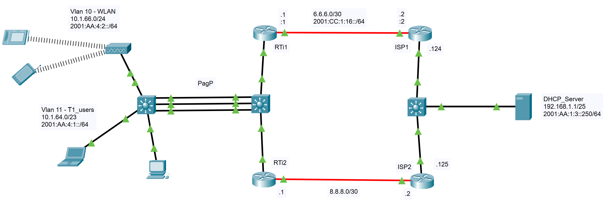

## VLSM Table - IPv4 -> 10.1.64.0/22, IPv6 -> 2001:AA:4::/48

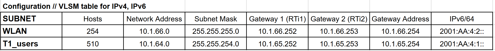

## Router Configuration

### RTi1

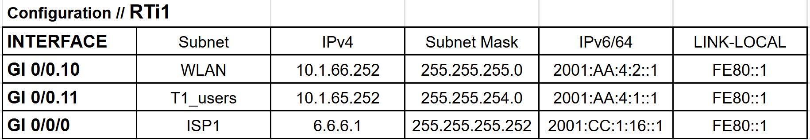

### RTi2

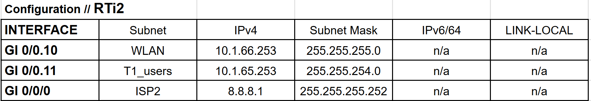

### ISP1

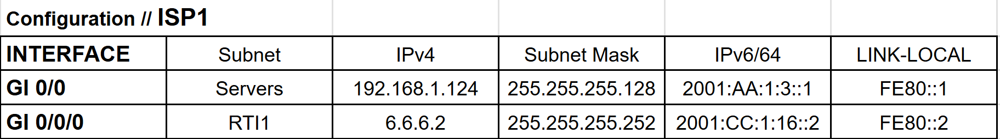

### ISP2

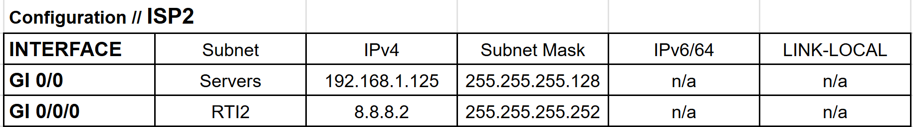

## Switch Security and Redundancy Features

- **Port Security** on access ports
- **Shutdown unused ports**
- **RPVST+** for per-VLAN loop prevention
- **VTP** for VLAN consistency across switches
- **PAgP** for EtherChannel link aggregation
- **HSRP** for gateway redundancy and high availability

## Testing and Validation

To validate the implementation, the following tests were conducted.

### IPv4 Ping Tests

- PC to PC within the same VLAN  
  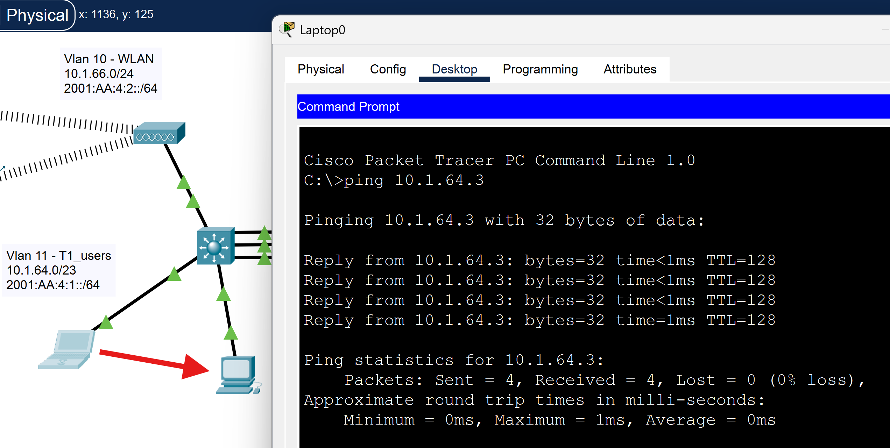

- PC to Wireless phone across VLANs (via router-on-a-stick)  
  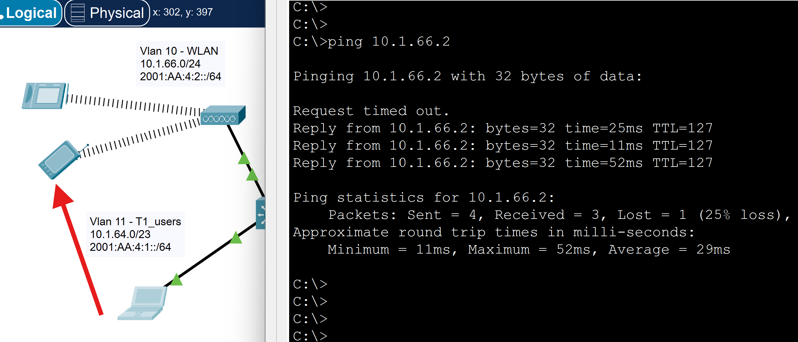

- PC to Server over IPv4  
  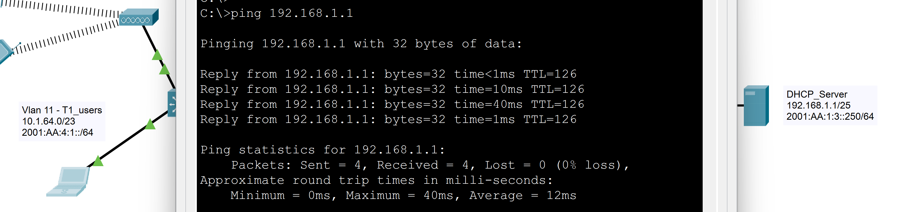

### IPv6 Ping Tests

- SLAAC-configured IPv6 devices communication between Wireless Tablet and PC 
  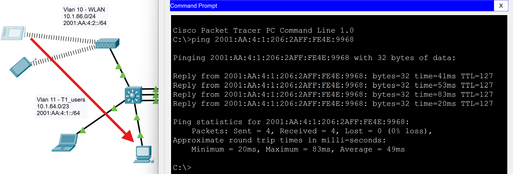

### DHCP Lease Verification

- Showing automatic IPv4 address  
  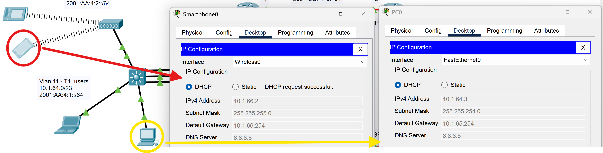

### SLAAC Verification

- Automatic IPv6 assignment  
  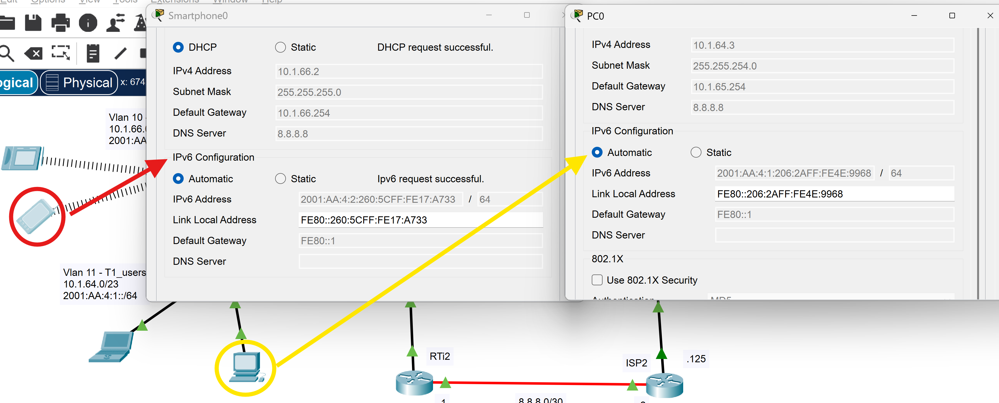

### Routing Table Tests

- Router with manually configured static routes  
  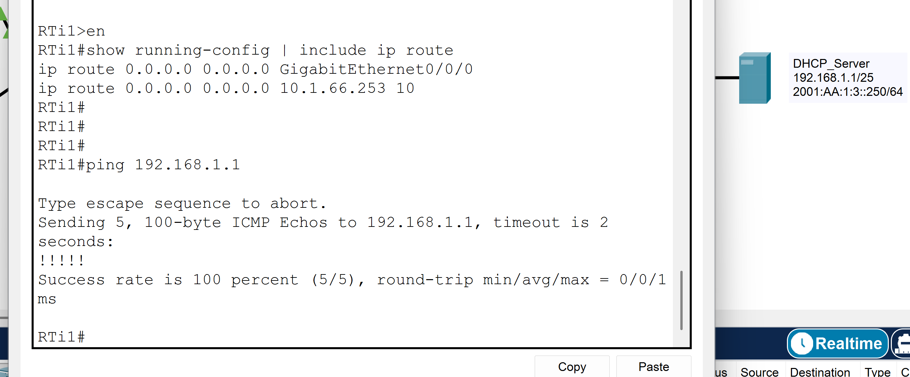

### HSRP Redundancy Test

- HSRP status and active router verification 
The following output from `show standby brief` on Router1 confirms that HSRP is configured correctly, showing the active and standby routers:

  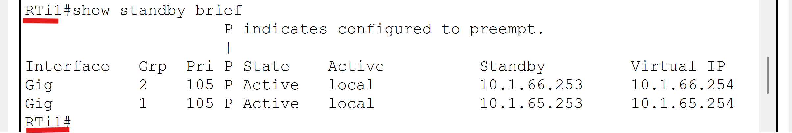

### EtherChannel / PAgP Test

- Port-channel operational and interfaces bundled  
The following output from `show etherchannel summary` shows that the Port-Channel group 1 is operational and the following interfaces are bundled:

  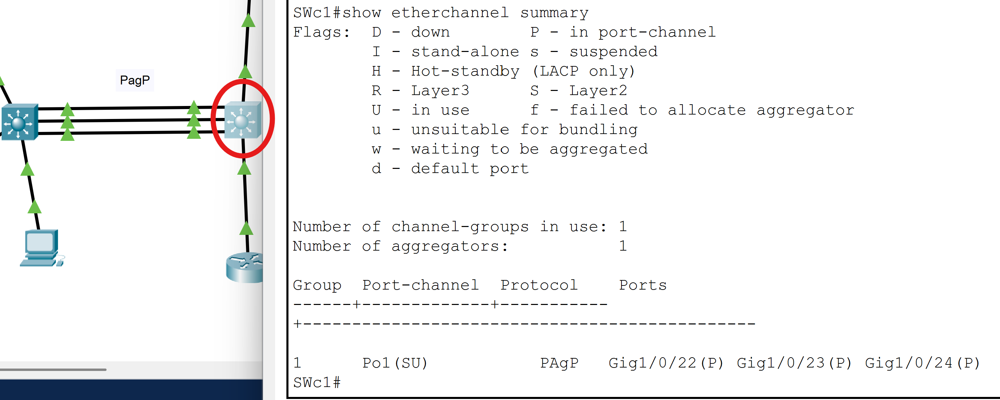

> These results confirm that the network operates correctly with redundancy, segmentation, and efficient address management.

## Project Structure

- `.pkt` -> Cisco Packet Tracer project file  
- `README.md` -> Full documentation  
- `/prints` -> Folder with screenshots and validation evidence

## Author

**Guilherme Miranda**  
[GitHub](https://github.com/gkmgrm)  
[LinkedIn](https://www.linkedin.com/in/gmiranda123/)
