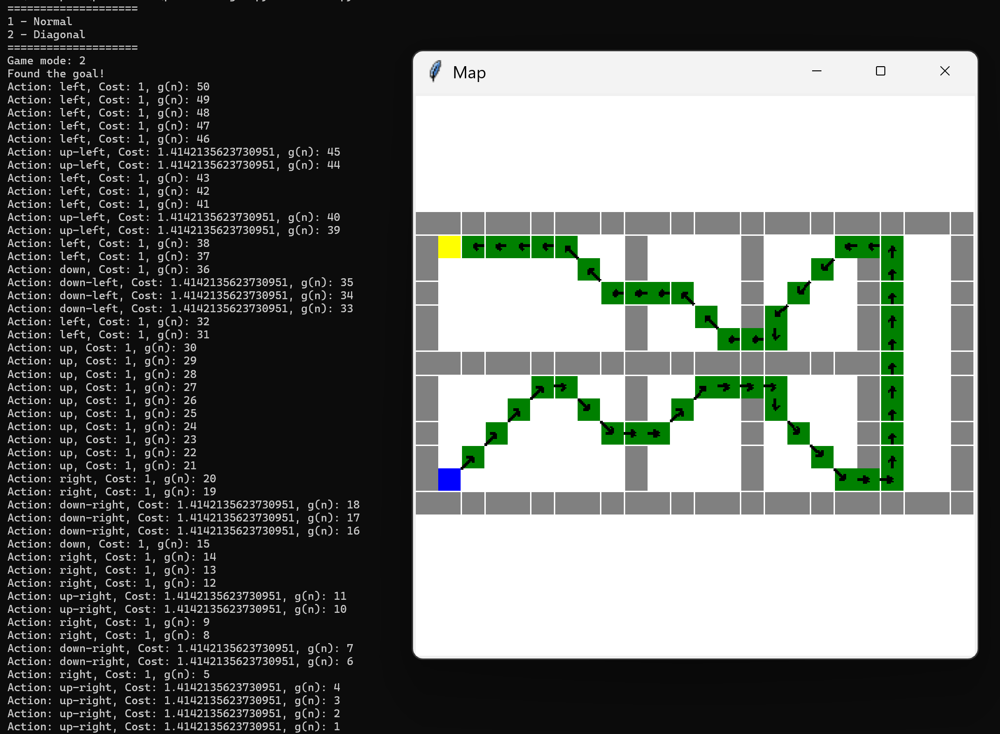
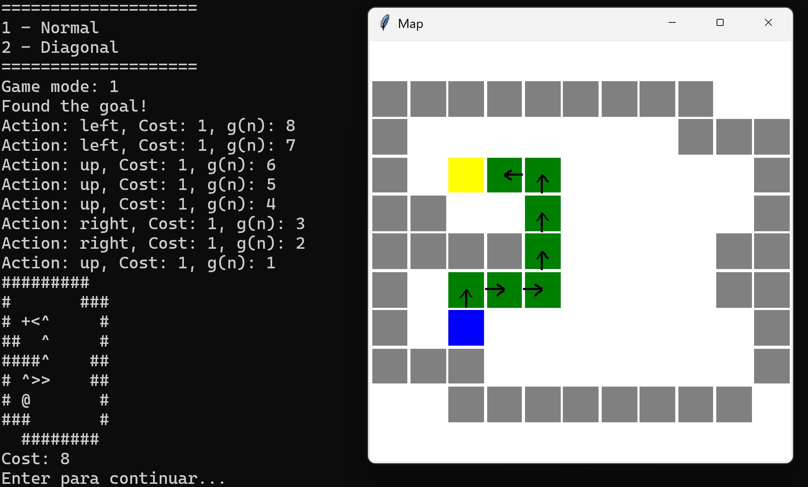
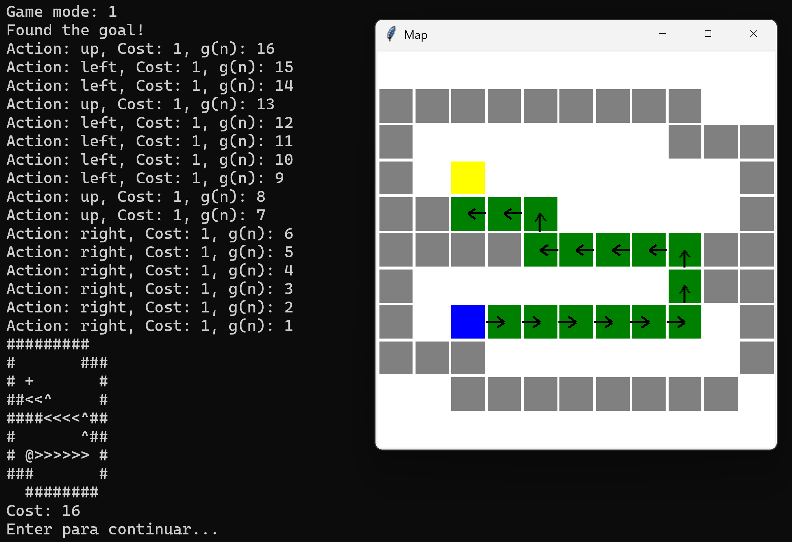

# Python Pathfinding Algorithm Visualizer

This project allows you to interactively visualize the operation of three classic pathfinding algorithms: **A\***, **BFS** (Breadth-First Search) and **DFS** (Depth-First Search). Through a graphical interface made with `tkinter`, the user can choose how the problem will be solved (with or without diagonals) and observe the path taken by the algorithm until it reaches the final point.

## Features

- Reading maps from `.txt` files
- Conversion of maps to the `Problem` class (without diagonals) or `ProblemDiagonal` (with diagonals)
- The graphical interface uses the **tkinter** library, which is a standard Python library for GUIs and was not developed by me.
- Visual execution of algorithms:
  - ✅ A* 
  - ✅ BFS (Breadth-First Search)
  - ✅ DFS (Depth-First Search)
- Animation of the search and visualization of the final path found


## How to Use

1. **Clone the repository**:
```bash
git clone https://github.com/gkmgrm/Projects.git
cd Projects/pathFindingAI
```

2. **Install tkinter (if necessary):**  
On Windows, tkinter usually comes pre-installed with Python. If you get an error related to `tkinter`, try:  
```bash
pip install tk
```

3. **Run the program**:
Each algorithm is in a separate Python file. To run an algorithm, use the corresponding command:

- To execute algorithm **A\***:
  ```bash
  python aStar.py
  ```
- To execute algorithm **BFS**:
  ```bash
  python bfs.py
  ```
- To execute algorithm **DFS**:
  ```bash
  python dfs.py
  ```

4. **In the interface**:
- Define whether you want to allow diagonal movements
- Click **Enter** to see the algorithm working

## How Maps Work

- Each map is a `.txt` file with representation of obstacles and free spaces
- The program converts the file contents to an object of the `Problem` or `ProblemDiagonal` class, depending on whether the user allows diagonal movements.

Example map (`Minicosmos22c.txt`):

```
#########
#       ###
# .       #
##        #
####     ##
#        ##
# @       #
###       #
  ########
```

- `@`: Player
- `.`: Goal
- `#`: Wall
- White spaces: free areas

## Implemented Algorithms

- **A\***: heuristic algorithm that combines real cost with estimate up to the target
- **BFS**: ensures the shortest path
- **DFS**: explores to the end before retreating (does not guarantee the shortest path)

Each of them is animated in the interface, showing the final path.

## Prints and Demos

### Example: A* algorithm with diagonals


### Example: BFS algorithm without diagonals


### Example: DFS algorithm without diagonals


## Project Objective

This project was developed with the objective of:

- Practice concepts of search algorithms
- Learn to represent real navigation problems

## Author

- **Guilherme Miranda**
- [GitHub](https://github.com/gkmgrm)
- [LinkedIn](https://www.linkedin.com/in/gmiranda123/)


